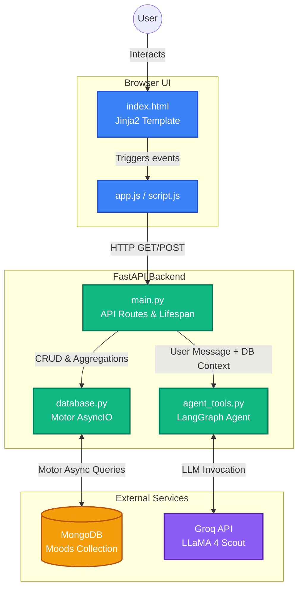

# MOODJOURNAL

> Track vibes. Analyze patterns. Chat with AI.

MOODJOURNAL is a full-stack mood tracking application featuring a high-performance FastAPI backend, asynchronous MongoDB storage, and an integrated AI emotional wellness companion powered by Groq and LLaMA 4.

## Features

* **Comprehensive Mood Tracking:** Log your moods along with intensity (1-10), contextual tags, activities, and personal notes.
* **Advanced Analytics:** Discover your emotional patterns through daily streaks, sentiment ratios, hourly/weekly breakdowns, and activity-mood correlations.
* **AI Mood Companion (MoodBot):** Chat with a built-in AI therapist/peer that has secure, full access to your mood database to provide highly personalized insights and pattern recognition.
* **Asynchronous Architecture:** Built with `motor` and `FastAPI` for non-blocking, high-speed database queries and API responses.

## Tech Stack

* **Backend:** FastAPI, Python 3.x, Pydantic
* **Database:** MongoDB (Async via Motor)
* **AI & LLM:** LangChain, LangGraph, Groq API (Meta LLaMA 4 Scout)
* **Frontend:** HTML5, CSS3, Vanilla JavaScript (Jinja2 Templates)

## Project Structure

```text
├── static/
│   ├── app.js            # Frontend logic and API calls
│   ├── particles.js      # Background animations/effects
│   ├── script.js         # Additional UI interactions
│   └── style.css         # Styling
├── templates/
│   └── index.html        # Main dashboard UI
├── .gitignore
├── README.md
├── agent_tools.py        # LangChain agent and MoodBot personality
├── database.py           # MongoDB connection and complex aggregation pipelines
├── main.py               # FastAPI application and route definitions
├── mood_data.json        # Seed data or local backup
└── requirements.txt      # Python dependencies
```

## Installation & Setup

1. **Clone the repository:**

```
git clone https://github.com/codewithkhushiii/mood_journal.git
cd mood_journal
```

2. **Set up a virtual environment (Recommended):**

```
python -m venv venv
source venv/bin/activate  # On Windows: venv\Scripts\activate
```

3. **Install dependencies:**

```
pip install -r requirements.txt
```

4. **Environment Variables:**

```
MONGODB_URI=mongodb://localhost:27017 # Or your MongoDB Atlas URI
MONGODB_DB=moodboard
GROQ_API_KEY=your_groq_api_key_here
```

5. **Run the Application:**

```
uvicorn main:app --host 0.0.0.0 --port 8000 --reload
```

***

### Architecture Diagram

Here is the Mermaid diagram illustrating how your frontend, FastAPI backend, MongoDB database, and the LangGraph/Groq AI agent interact.


