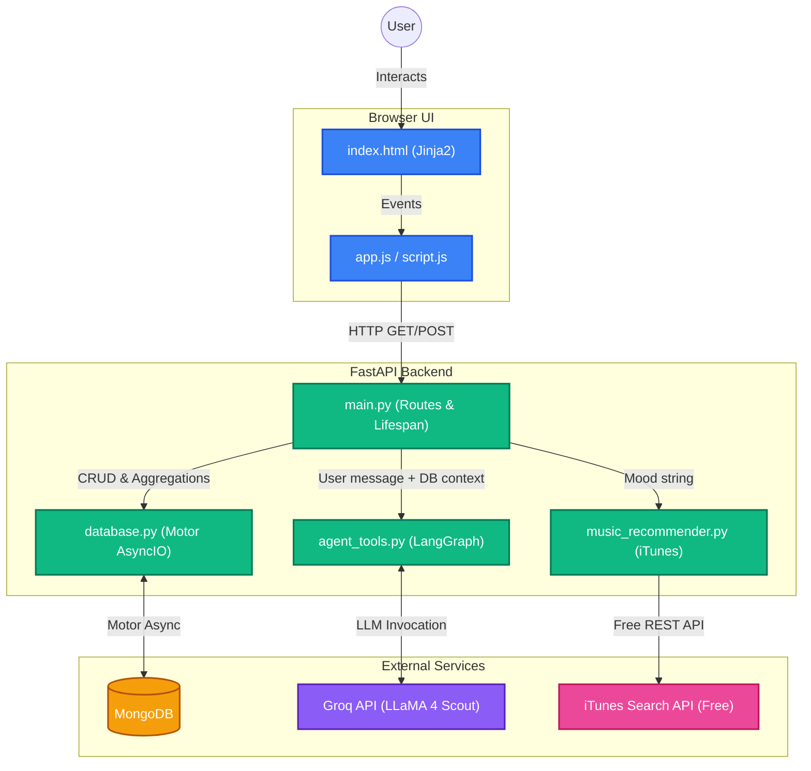

# MOODJOURNAL

> Track vibes. Analyze patterns. Chat with AI. Discover music.

MOODJOURNAL is a full-stack mood tracking application featuring a high-performance FastAPI backend, asynchronous MongoDB storage, an integrated AI emotional wellness companion powered by Groq and LLaMA 4, and **free iTunes-powered music recommendations** — no third-party music account or API key required.

---

## Features

- **Comprehensive Mood Tracking:** Log moods with intensity (1–10), contextual tags, activities, and personal notes.
- **Advanced Analytics:** Discover emotional patterns through daily streaks, sentiment ratios, hourly/weekly breakdowns, and activity-mood correlations.
- **AI Mood Companion (MoodBot):** Chat with a built-in AI therapist/peer that has secure, full access to your mood database for highly personalized insights and pattern recognition.
- **iTunes Music Recommendations:** Get instant, mood-matched song suggestions powered by Apple's free iTunes Search API — no account, no API key, no cost.
- **Asynchronous Architecture:** Built with `motor` and `FastAPI` for non-blocking, high-speed database queries and API responses.

---

## Tech Stack

| Layer | Technology |
|---|---|
| **Backend** | FastAPI, Python 3.x, Pydantic |
| **Database** | MongoDB (Async via Motor) |
| **AI / LLM** | LangChain, LangGraph, Groq API (Meta LLaMA 4 Scout) |
| **Music API** | Apple iTunes Search API (free, no key needed) |
| **Frontend** | HTML5, CSS3, Vanilla JavaScript (Jinja2 Templates) |

---

## Project Structure

```text
mood_journal/
├── static/
│   ├── app.js               # Frontend logic and API calls
│   ├── particles.js         # Background animations/effects
│   ├── script.js            # Additional UI interactions
│   └── style.css            # Styling
├── templates/
│   └── index.html           # Main dashboard UI
├── .env                     # Environment variables (not committed)
├── .gitignore
├── README.md
├── agent_tools.py           # LangChain agent and MoodBot personality
├── database.py              # MongoDB connection and aggregation pipelines
├── main.py                  # FastAPI application and route definitions
├── mood_data.json           # Seed data or local backup
├── music_recommender.py     # iTunes-powered mood music recommendations
└── requirements.txt         # Python dependencies
```

---

## Music Recommendations

Music is fetched live from Apple's **iTunes Search API** (`https://itunes.apple.com/search`).

- ✅ Completely **free** — no Apple account required
- ✅ **No API key** or credentials needed
- ✅ Returns track title, artist, album, album art (300×300), a 30-second preview URL, and an iTunes Store link
- ✅ Supports **10 moods**: `happy`, `sad`, `stressed`, `angry`, `calm`, `excited`, `anxious`, `romantic`, `focused`, `energetic`
- ✅ Falls back to a curated static song list if the API is unreachable

Each mood maps to several search queries that are rotated randomly for variety. Common mood aliases (e.g. `chill` → `calm`, `pumped` → `energetic`) are also resolved automatically.

### Response Shape

```json
{
  "mood": "happy",
  "emoji": "😊",
  "source": "itunes",
  "song": {
    "title": "...",
    "artist": "...",
    "album": "...",
    "album_art": "https://...",
    "itunes_url": "https://music.apple.com/...",
    "preview_url": "https://audio-ssl.itunes.apple.com/...",
    "duration_ms": 210000,
    "track_number": 3
  },
  "recommendations": [ "...up to 5 tracks..." ],
  "message": "🎧 iTunes picked 'Happy' by Pharrell Williams for your happy mood!"
}
```

---

## Installation & Setup

### 1. Clone the repository

```bash
git clone https://github.com/codewithkhushiii/mood_journal.git
cd mood_journal
```

### 2. Set up a virtual environment (recommended)

```bash
python -m venv venv
# Windows
venv\Scripts\activate
# macOS / Linux
source venv/bin/activate
```

### 3. Install dependencies

```bash
pip install -r requirements.txt
```

### 4. Configure environment variables

Create a `.env` file in the project root with the following:

```env
MONGODB_URI=mongodb://localhost:27017
MONGODB_DB=moodboard
GROQ_API_KEY=your_groq_api_key_here
```

> **Note:** No music-related credentials are needed. The iTunes Search API is completely free and public.

### 5. Run the application

```bash
uvicorn main:app --host 0.0.0.0 --port 8000 --reload
```

Then open your browser at `http://localhost:8000`.

---

## Architecture Diagram



---

## Environment Variables Reference

| Variable | Required | Description |
|---|---|---|
| `MONGODB_URI` | ✅ Yes | MongoDB connection string |
| `MONGODB_DB` | ✅ Yes | MongoDB database name |
| `GROQ_API_KEY` | ✅ Yes | Groq API key for LLaMA 4 |

> 🎵 No music API keys are needed. iTunes Search is free and open.

---

## License

MIT
